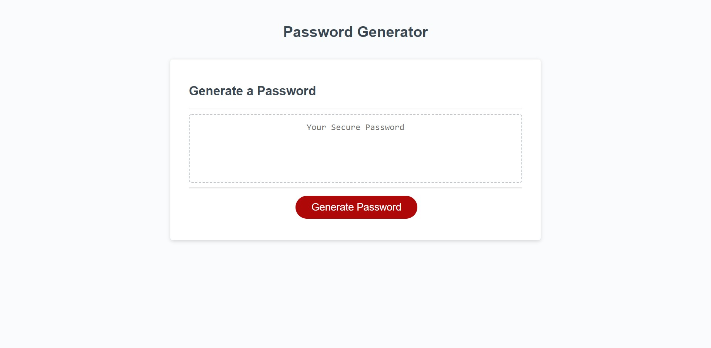

# Create A Random Password Generator

## Link to Live Site
https://wtriii.github.io/Random-Password-Generator-WTRIII/

## Summary

The purpose of the homework was to create a password generator using js. HTML and CSS code was provided.

All user criteria were implemented as follows:

- user click of the html button begins selection of password criteria
- user is prompted to input password length and confirm characters to be used
- password length range is between 8 and 128 characters with an alert if that requirement is not met
- character selection for the password is given through confirm windows
- password is generated using user criteria
- password is displayed on the page

## Image of completed product

## User Criteria

GIVEN I need a new, secure password

WHEN I click the button to generate a password
THEN I am presented with a series of prompts for password criteria

WHEN prompted for password criteria
THEN I select which criteria to include in the password

WHEN prompted for the length of the password
THEN I choose a length of at least 8 characters and no more than 128 characters

WHEN asked for character types to include in the password
THEN I confirm whether or not to include lowercase, uppercase, numeric, and/or special characters

WHEN I answer each prompt
THEN my input should be validated and at least one character type should be selected

WHEN all prompts are answered
THEN a password is generated that matches the selected criteria

WHEN the password is generated
THEN the password is either displayed in an alert or written to the page
